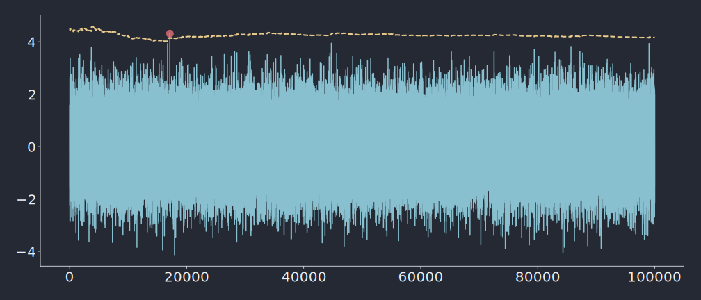

## Install

You can install the python bindings through `pip`. It ships the whole library (so you don't have to install it beforehand).

```shell
pip install libspot
```

The bindings are implemented as a CPython `C` extension (i.e. directly using the CPython API). So the overhead is low (but it deserves to be evaluated).

<!-- prettier-ignore -->
!!! info
    This `C` extension uses the [CPython Limited API](https://docs.python.org/3/c-api/stable.html#limited-c-api). It makes the built wheels compatible with multiple versions of Python. So in practice, a single wheel is built for each OS et can be installed along with any `CPython>=3.6`.

## Get started

<!-- prettier-ignore -->
```python
--8<-- "examples/basic.py"
```


