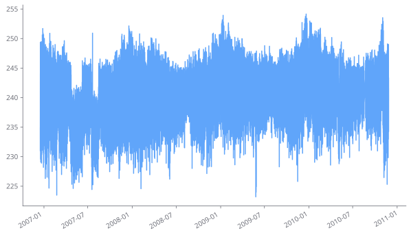
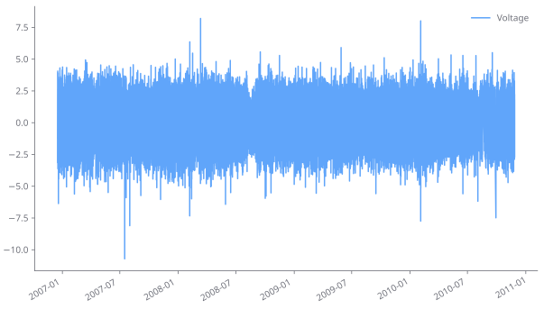
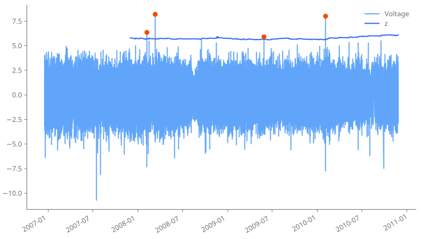
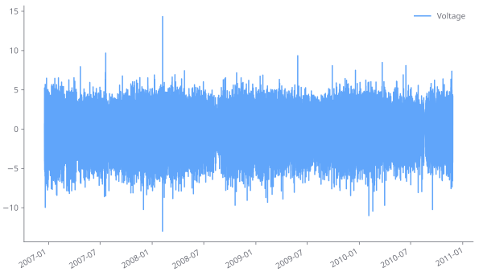
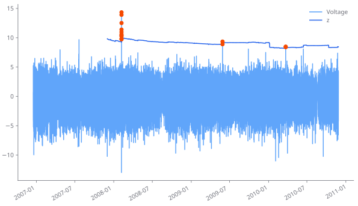

It is important to note that SPOT works only on stationnary data. It means that **the data distribution must not change along time**.

In many real-worl usecases (finance, cyber, weather...) we do have drifting data. In these cases, SPOT can be used at the backend of a model catching that drift. 

In this guide we show how we can use SPOT on the [household power consumption dataset](https://archive.ics.uci.edu/dataset/235/individual+household+electric+power+consumption).


```python
import pandas as pd

P = pd.read_csv("./data/household_power_consumption.txt", sep=";", na_values="?")
P.index = pd.to_datetime(P["Date"] + " " + P["Time"], format="%d/%m/%Y %H:%M:%S")
P = P.drop(columns=["Date", "Time"]).dropna()
```

Let us consider the `Voltage` measure. If we plot it, we notice that the distribution is not stationnary.


```python
P["Voltage"].plot();
```


    

    


## Diffing

A first simple trick is to differentiate data, so as to remove the trend. In this example, we notice that the output distribution looks better.


```python
Q = pd.DataFrame(P["Voltage"]).diff()
Q.plot();
```


    

    


Now let us take the first 500000 values to fit a `Spot` instance. As we have a bunch of data, we can set "large" parameters (low `q`, high `level` and `max_excess`).


```python
from libspot import Spot, ANOMALY

training_size = 500_000
training = Q.iloc[:training_size]["Voltage"].dropna().values

spot = Spot(q=1e-7, level=0.995, max_excess=5000)
spot.fit(training)
```

Eventually, we can run SPOT on the remaining data, storing the threshold for instance.


```python
thresholds = {}
anomalies = {}
for row in Q.iloc[training_size:].itertuples():
    status = spot.step(row.Voltage)
    thresholds[row.Index] = spot.anomaly_threshold
    if status == ANOMALY:
        anomalies[row.Index] = row.Voltage

Q["z"] = pd.Series(thresholds)
Q["anomaly"] = pd.Series(anomalies)

```


```python
ax = Q[["Voltage", "z"]].plot()
Q["anomaly"].plot(ax=ax, style='o', color="#f54900", label="Anomalies");
```


    

    


## Moving average

Another way to catch the trend is to use a moving average. For instance on 30 measures (30 minutes).


```python
R = pd.DataFrame(P["Voltage"] - P["Voltage"].rolling(30).mean()).dropna()
R.plot();
```


    

    


Then we can analyze the data with SPOT as before.


```python
training_size = 500_000
training = R.iloc[:training_size]["Voltage"].dropna().values

spot = Spot(q=1e-6, level=0.99, max_excess=10000)
spot.fit(training)

thresholds = {}
anomalies = {}
for row in R.iloc[training_size:].itertuples():
    status = spot.step(row.Voltage)
    thresholds[row.Index] = spot.anomaly_threshold
    if status == ANOMALY:
        anomalies[row.Index] = row.Voltage

R["z"] = pd.Series(thresholds)
R["anomaly"] = pd.Series(anomalies)

ax = R[["Voltage", "z"]].plot()
R["anomaly"].plot(ax=ax, style='o', color="#f54900", label="Anomalies");
```


    

    

