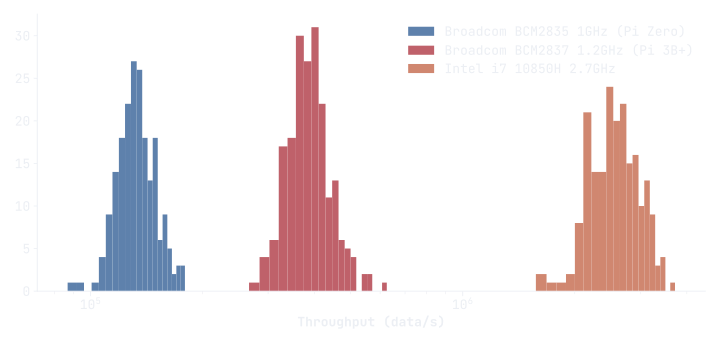

SPOT stands for **S**treaming **P**eaks **O**ver **T**hreshold. It is an adaptation of the POT method (you got it) for streaming data. In a word, this method computes high quantiles that are used as anomaly threshold.

